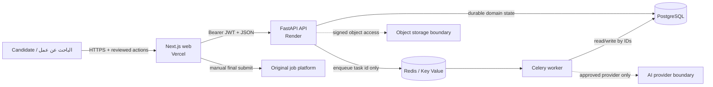
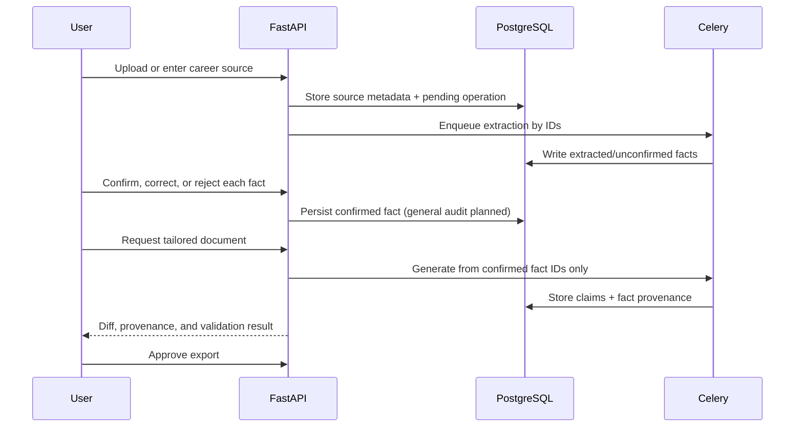

# بنية AI Career Agent | System Architecture

الحالة: قرار هندسي للـMVP، 2026-08-06. هذه الوثيقة تصف الهدف التشغيلي ومناطق
الثقة؛ [عقود المنتج](product-contracts.md) هي المرجع للسلوك، و[سياسة الخصوصية
والمنصات](privacy-and-platform-policy.md) هي المرجع للقيود.

## أهداف التصميم

1. **Evidence first:** فصل الحقائق المهنية عن الصياغة وربط كل ادعاء نهائي
   بحقيقة مؤكدة.
2. **Human controlled:** المستخدم يؤكد الاستخراج ويراجع المستند ويقدم الطلب.
3. **Explainable:** الدرجات والقرارات مركبة من متطلبات ظاهرة، لا نموذج غامض.
4. **Policy aware:** كل موصل مقفول افتراضيًا وتُفصل صلاحيات البحث والجلب
   والتقديم.
5. **Bilingual by construction:** العربية والإنجليزية وRTL/LTR جزء من النموذج
   والتجربة، لا طبقة ترجمة لاحقة.
6. **Small-team operability:** أقل عدد ممكن من الخدمات مع حدود واضحة تسمح
   بالتوسع.

## السياق والمكونات

### Next.js web

- App Router وTypeScript وTailwind؛ الواجهة responsive وWCAG 2.2 AA مستهدفة.
- يملك حالة العرض فقط. لا يقرر صحة حقيقة ولا يحسب التطابق كمرجع نهائي.
- يستدعي الـAPI بعنوان عام من المتصفح وعنوان داخلي عند server-side rendering.
- Clerk هو خيار مصادقة الـMVP؛ الـAPI يتحقق من JWT ولا يثق بمعرف مستخدم مرسل
  في body أو query.

### FastAPI API

- حد الثقة العام: المصادقة، التفويض، التحقق، وسياسات المصدر.
- ينفذ عمليات المجال السريعة والحتمية ويعيد OpenAPI من `/docs`.
- ينشئ سجلًا دائمًا للعمل قبل إرسال مهمة خلفية، ثم يعيد معرف العملية.
- `/health/live` يفحص العملية فقط؛ `/health/ready` يفحص اعتماديات الخدمة اللازمة
  لاستقبال حركة المرور.

### PostgreSQL

مصدر الحقيقة الوحيد لحالة المجال: المستخدم، الملف، المصدر، الحقيقة، الوظيفة،
المتطلب، التحليل، المستند، الادعاء، الطلب، النتيجة وسياسة المصدر. `ClaimEvidence`
و`DeletionReceipt` منفذان؛ سجل `AuditEvent` العام متطلب قبل الإنتاج وغير منفذ
في الـfoundation الحالي. تطبق تغييرات المخطط بواسطة Alembic.
`AUTO_CREATE_SCHEMA=true` محلي فقط؛ يجب أن يكون `false` في الإنتاج.

تسلسل الثقة يستخدم `evidence_revision` للملف و`requirements_revision` للوظيفة
مع CAS ذري وترتيب قفل ثابت `profile -> job/document`. كما يثبت الحذف
`deletion_started_at` قبل تعداد الرسم، فتُرفض الكتابات المتأخرة بدل أن تنجو من
الحذف. اختبارات guards الحالية تمر على SQLite؛ يبقى اختبار تزامن PostgreSQL
فعلي بوابة قبل الـbeta.

### Celery + Redis

تنتقل المهام المكلفة أو المعرضة للفشل—مثل تحليل ملف، تحليل وظيفة، توليد مستند،
وتجهيز التصدير/الحذف—إلى Celery. Redis وسيط طابور ونتائج قصيرة العمر فقط، ولا
يحمل النسخة الوحيدة من أي بيانات مهنية.

سبب الاختيار: تكامل Python مباشر، خبرة تشغيلية واسعة، نشر worker مستقل على
Render، وكلفة ذهنية أقل لفريق صغير. مهام الـMVP قصيرة، ويمكن جعلها idempotent،
وتُحفظ حالتها التجارية في PostgreSQL. ننتقل إلى Temporal فقط إذا أصبحت لدينا
تدفقات متعددة الأيام، timers كثيرة، انتظار موافقات بشرية داخل workflow، أو
حاجة مثبتة إلى replay وديمومة تنسيق أقوى.

قواعد المهام:

- الرسالة تحتوي معرفات داخلية وأقل قدر من البيانات، لا CV كاملًا في Redis.
- لكل مهمة `operation_id` ومفتاح idempotency؛ retry لا ينشئ مستندًا أو نتيجة
  مكررة.
- retries بحد أقصى وbackoff؛ الخطأ النهائي يسجل رمزًا آمنًا للمستخدم دون نصه
  المهني في logs.
- acknowledgement بعد حفظ النتيجة الدائمة. إلغاء المستخدم أو حذف الحساب يمنع
  commit لنتيجة متأخرة.
- `noeviction` إلزامية لطابور Redis حتى تفشل الكتابة بوضوح بدل إسقاط مهمة صامتًا.

## تدفق الحقيقة إلى المستند

الحاجز الحاسم يكون في الخادم: prompt أو واجهة المستخدم ليست حماية كافية. قبل
اعتماد أو تصدير مستند، يعيد validator بناء مجموعة الادعاءات ويتأكد أن كل ادعاء
واقعي يملك رابطًا إلى حقيقة `confirmed` تخص المستخدم نفسه. الفشل يغلق التصدير.

## حدود البيانات والتكامل

- **Job URLs:** تخزن كنص مرجعي. الـAPI لا يفتح URL من منصة محظورة، ما يمنع
  scraping وSSRF معًا.
- **Licensed feed:** موصل مستقل لا يعمل إلا إذا كانت `can_search=true` وتغطي
  الرخصة الاستخدام والتخزين والعرض.
- **Uploads:** PDF/DOCX فقط بعد فحص النوع والحجم والبرمجيات الخبيثة. التخزين
  الإنتاجي object storage مشفر بروابط قصيرة العمر، وليس قرص Render المؤقت.
- **AI provider:** adapter خلف واجهة داخلية مع موصلين لـOpenAI وMistral. القيمة
  الافتراضية `deterministic`؛ أي مزود خارجي يحتاج DPA، منع التدريب/الاحتفاظ،
  وتقييم نقل بيانات قبل استخدام بيانات حقيقية.
- **Authentication:** Clerk يصدر الهوية؛ جداول المجال تخزن `subject` خارجيًا
  ثابتًا لا رموز الجلسة. لا تُخزن كلمات مرور.

## النشر والبيئات

| البيئة | Web | API/worker | Data | البيانات المسموحة |
|---|---|---|---|---|
| Local | Next/Docker | Docker Compose | Postgres + Redis محليان | بيانات مصطنعة فقط |
| CI | GitHub-hosted runners | lint/tests/build | خدمات مؤقتة عند الحاجة | fixtures مصطنعة |
| Staging | Vercel | Render Blueprint | Render Postgres/Key Value | بيانات مصطنعة/مجهولة |
| Production candidate | Vercel | Render | Render managed data | محظور حتى بوابة PDPL |

اخترنا Frankfurt في `render.yaml` لتجميع الموارد في منطقة واحدة وتقليل المسافة
من السعودية ضمن مناطق Render المتاحة، وليس باعتباره قرار امتثال أو إقامة
بيانات. تفعيل الإنتاج مشروط بتقييم نقل البيانات والمورّدين؛ وقد يتطلب نقل
الخدمات إلى مزود داخل المملكة.

## الأمن والاعتمادية

- TLS فقط خارج local؛ CORS allowlist دقيقة، ولا wildcard مع credentials.
- أسرار الإنتاج في لوحات Vercel/Render بـleast privilege وrotation، ولا تُبنى
  `NEXT_PUBLIC_*` إلا للقيم العامة فعلًا.
- authorization على كل سجل بواسطة مالكه؛ UUID غير كافٍ كحماية.
- timeouts وحدود حجم ومعدل للرفع والتحليل والتوليد.
- structured logs بمعرف طلب/عملية، مع منع body وCV وprompt وtoken وURL الموقّع.
- نسخ احتياطية مشفرة واختبارات استعادة وحذف ممتد إلى النسخ حسب السياسة.
- readiness تمنع المرور عند فقد قاعدة البيانات؛ فشل Redis لا يمنع قراءة الملف
  والطلبات لكنه يمنع بدء عمل خلفي جديد برسالة واضحة.

## المراقبة ومقاييس المنتج

نفصل المقاييس التشغيلية عن المهنية. التشغيل: latency، error rate، عمق الطابور،
عمر أقدم مهمة، retries، ووقت المعالجة. المنتج: إكمال الملف الموثق، زمن حزمة
التقديم، تغطية الأدلة، وتسجيل النتائج. المقياس الشمالي هو المقابلات البشرية
المؤهلة لكل طلب أكد المستخدم إرساله، وليس عدد الطلبات.

لا تسجل telemetry نص الوظيفة أو الحقائق المهنية. تقسيم جودة النظام حسب اللغة
أو الفئة يستخدم معرفات/تصنيفات مجمعة ومصرحًا بها، مع حد أدنى لحجم المجموعة.

## قرارات مؤجلة صراحة

- مزود object storage وموقعه بعد تقييم الإقامة والنقل.
- اعتماد مزود AI ونموذجه للإنتاج بعد اختبارات hallucination والخصوصية ونقل البيانات.
- licensed Saudi job feed بعد عقد يسمح بالبحث والتخزين والعرض.
- الانتقال من Celery إلى Temporal فقط عند تحقق مؤشرات التعقيد المذكورة.
